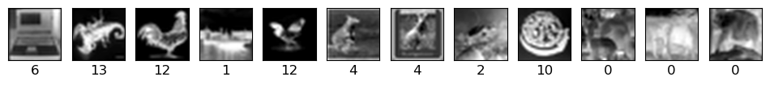
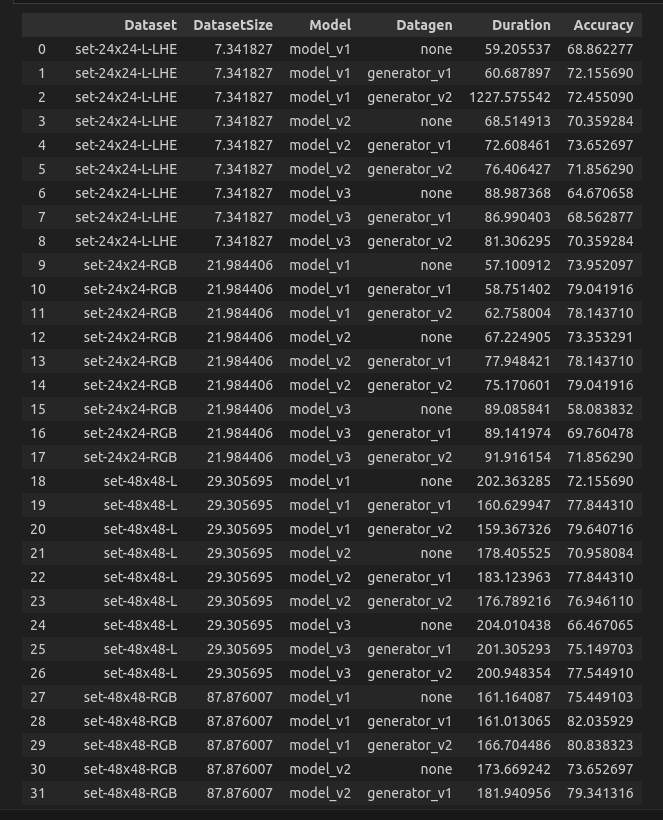
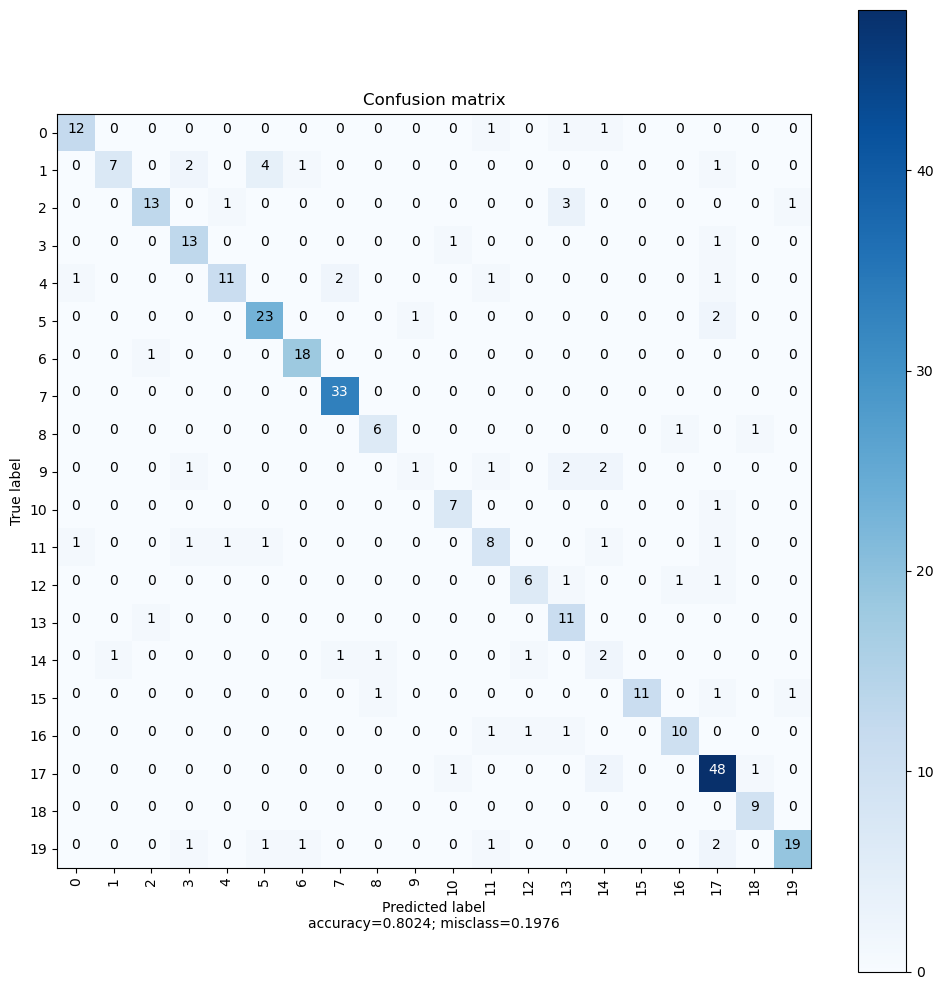

# Classement d’images - CNN --- Par Donatien YETO

Dans ce document nous allons expliquer la structure de notre solution à travers les différentes étapes clés puis parler brièvement des résultats obtenus.

Notre projet est constitué de 5 notebooks constituant  les différentes étapes de notre résolution.

## 00-View-and-process-data
Pour commencer, nous avons lu les images fournies (fonction read_images).  A chaque étiquette se trouvant dans etiquettes.txt nous lisons les images et leur associons un entier unique comme numéro de classe dans y.  Nous conservons aussi dans labels l'association class_name <-> class_number.

En visualisant les images, on remarque qu’elles ne sont pas de même dimension. 

Ce qui nous amène à faire un prétraitement des images. La fonction myutils/dataset.py : images_enhancement nous a permis de les redimensionner et surtout de les convertir comme par exemple en blanc-noir. 

Les images traitées sont alors stockées dans un nouveau dossier (output_dir) pour être utilisées dans la suite. 

## 01-Simple-model
Avec scale=0.5 dans 00-View-and-process-data, nous avons prétraité la moitié des images dans ./data-0.5-scale. 
Nous avons faire un premier modèle avec les images blanc noir (set-24x24-L.h5)

Nous avons obtenu une précision de 43%. 

## 02-Data-augmentation
Ici nous avons utilisé keras.preprocessing.image.ImageDataGenerator. Elle permet de générer des lots d'images augmentées en temps réel pendant l'entraînement du modèle. Elle est souvent utilisée pour augmenter la taille du jeu de données d'entraînement en appliquant diverses transformations aux images.

En combinaison avec set-24x24-RGB.h5 et epochs=20, nous obtenons 55% de précision. 

Ici nous avons aussi intégré les callbacks TensorBoard pour visualiser l'apprentissage de notre modèle. 

## 03-Full-convolution
Nous avons mis en place ici notre protocole expérimental complet pour la sélection de meilleur modèle.
La sélection se base sur:
 ### - les couches du modèle

Nous avons défini 4 modèles CNN différents en jouant sur le nombre et type de couche, les hyperparamètre comme nombre de filters, kernel_size, padding (myutils/models.py)

 ### - le dataset d'entraînement 

Le prétraitement d’images a permis d'obtenir différents formats d’images au choix (set-24x24-L-LHE', 'set-24x24-RGB', 'set-48x48-L' ,'set-48x48-RGB','set-48x48-RGB-HE', …)

### - avec ou sans augmentation de données
Nous avons aussi joué sur les hyperparamètres du générateur au cas où on en utilise.

### - et parfois d’autre paramètres comme patch_size, epochs

Notre fonction myutils/experimental_protocol.py : experimental_protocol_multi_run fait plusieurs run avec différentes possibilités de combinaisons pour fournir un rapport. 

Voici une partie du rapport d’un multi run. 

On peut voir la combinaison donnant le meilleur score : 82% . 

# 04-Test-best-model
Nous avons fait quelques prédictions avec le meilleur modèle. Les résultats sont satisfaisants. Une erreur sur 12 :)

Voici la matrice de confusion. 

